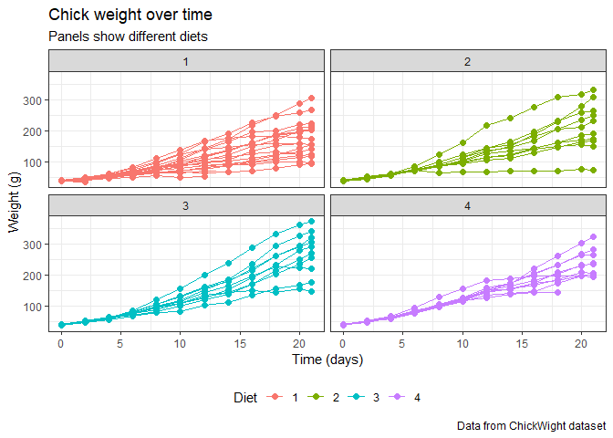
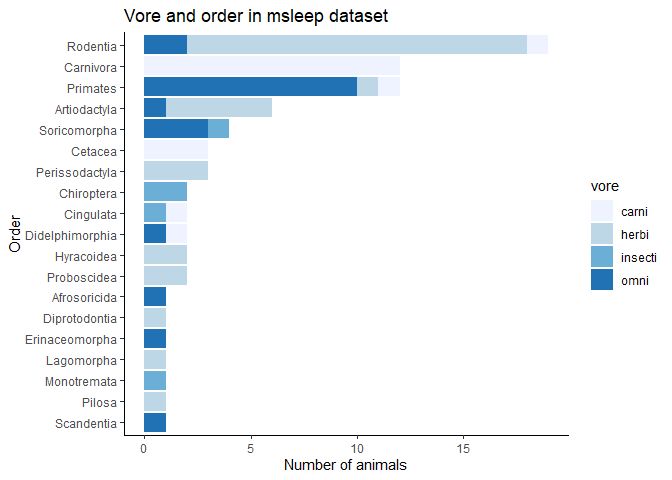
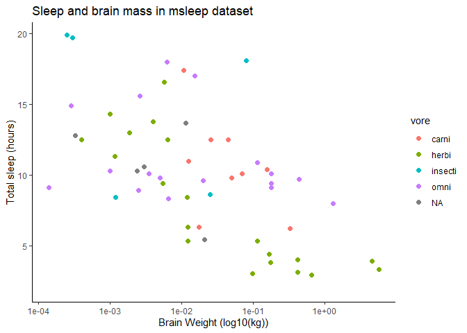

# Part 0: Background

### 0.1 ggplot2 

* part of tidyverse suite of packages  
* based on the 'grammar of graphics'    
* a graph is composed of layers of functions joined together with `+`   
* it is super flexible. If you can think of it, you can probably do it!  
* the main thing ggplot2 doesn't like is multiple axes on one graph (but can be done with additional packages)   
* today is a very quick flavour of ggplot2, concentrating on the structure   

### 0.2 Set-up 

* if you haven't already, install tidyverse with packages -> install  or `install.packages("tidyverse")`  
* ctrl-shift-N to open new script  
* load a package using `library()`. good practice to put afterwards what it's for  


*Load tidyverse* 


```r
library(tidyverse)
```

```
## -- Attaching packages --------------------------------------- tidyverse 1.3.0 --
```

```
## v ggplot2 3.3.2     v purrr   0.3.4
## v tibble  3.0.4     v dplyr   1.0.2
## v tidyr   1.1.2     v stringr 1.4.0
## v readr   1.4.0     v forcats 0.5.0
```

```
## -- Conflicts ------------------------------------------ tidyverse_conflicts() --
## x dplyr::filter() masks stats::filter()
## x dplyr::lag()    masks stats::lag()
```


 
# Part 1: Creating graphs

### Step 1: ggplot()  

* all graphs start with ggplot()  
* then data  
* then assign variables in the dataset to parts of the graph (x, y etc) using aes()  
* data and aes() can be done within geoms (see below) if you're plotting multiple datasets  

### Step 2: assign geom 
  
* geoms are the type of graph - bar, points, histograms etc  
* there are many different types but I'll just show a couple of examples  

#### geom_point()  

* make dot plots. 
* use `colour =` in `aes()` for different colours  
* use `colour =` and `size =` outside `aes()` to change colour and size for everything   


#### geom_line()  

* draws lines. Use with or without geom_point()  
* use `colour =` in `aes()` for different colours  
* use `colour =` and `size =` outside `aes()` to change colour and size for everything   


#### geom_col()  

* counts up the number of observations in the dataset  
* use `fill = ` in `aes()` for different colours  
* use `fill = ` in `aes()` for same colour for everything   
* use `geom_col(position = position_dodge()` to put side by side  
* use `+ coord_flip` to do horizontal bars  


#### geom_bar()   

* same as geom_col but you tell R the y value - more useful on summarised datasets  
* use `fill = ` in `aes()` for different colours  
* use `fill = ` in `aes()` for same colour for everything   
* use `geom_col(position = position_dodge()` to put side by side  
* use `+ coord_flip` to do horizontal bars  


### Step 3: Controlling order of categorical items  

* use factors!  
* method 1: get dataset in the order you want to use then `aes(x = fct_inorder(varaible))`  
* method 2: assign factor outside `datset$x <- factor(dataset$x, levels = c("D", "A", "B", "C"))`  


### Step 4: faceting (if needed)  
* split one graph into multiple panels  
* `facet_wrap(~var1)` splits by one variable only. Use `~` to tell ggplot2 it's looking for variable   
* `facet_wrap(var1~var2)` shows two variables as rows and columns  
* use `facet_wrap(~var1, scale = "free")` to allow scales to differ (also `"free_x"` and `"free_y"`)  
* if you want panels of different variables, either pivot data really long first or use `cowplot` package  


### Step 5:  labels using labs()  
* `title = `  
* `x = `
* `y = `
* `subtitle = `
* `caption = `


### Step 6: control axes and colours using scale_*
* label percents: `scale_x_continuous(labels = labels::percent())`  
* control colours palettes here (see resources below)  


### Step 7: control base graph appearance with theme ()  
* `theme_classic()` and `theme_bw()` are common  
* theme(legend.postion = "bottom") is useful  
* axis text rotation is in theme()  

# Part 2: A couple of examples
### Example 1: Faceted dot and line plot

* ChickWeight is a dataset looking at weights over time of chicks fed different diets  


```r
glimpse(ChickWeight)
```

```
## Rows: 578
## Columns: 4
## $ weight <dbl> 42, 51, 59, 64, 76, 93, 106, 125, 149, 171, 199, 205, 40, 49...
## $ Time   <dbl> 0, 2, 4, 6, 8, 10, 12, 14, 16, 18, 20, 21, 0, 2, 4, 6, 8, 10...
## $ Chick  <ord> 1, 1, 1, 1, 1, 1, 1, 1, 1, 1, 1, 1, 2, 2, 2, 2, 2, 2, 2, 2, ...
## $ Diet   <fct> 1, 1, 1, 1, 1, 1, 1, 1, 1, 1, 1, 1, 1, 1, 1, 1, 1, 1, 1, 1, ...
```

```r
ggplot(ChickWeight, 
       aes(x = Time, y = weight, group = Chick, colour = Diet)) +
  geom_point(size = 2) +
  geom_line() +
  facet_wrap(~Diet, ncol = 2) +
  labs(title = "Chick weight over time", 
       x = "Time (days)", 
       y = "Weight (g)", 
       subtitle = "Panels show different diets", 
       caption = "Data from ChickWight dataset") +
  theme_bw() +
  theme(legend.position = "bottom")
```

<!-- -->

### Example 2: Bar chart from summary table  

* msleep is the dataset from last week looking a sleep time in mammals  
* we'll first create a summary table to plot  
* we'll also put it in the order that we'd like to plot in  


```r
msleep_summ <- msleep %>% 
  filter(!is.na(vore)) %>% 
  count(order, vore) %>% 
  group_by(order) %>% 
  mutate(n_order = sum(n)) %>% 
  ungroup() %>% 
  arrange(desc(n_order))


ggplot(msleep_summ, 
       aes(x = fct_rev(fct_inorder(order)), y = n, fill = vore)) +
  geom_col() +
  coord_flip() +
  scale_fill_brewer() +
  labs(title = "Vore and order in msleep dataset", 
       y = "Number of animals", 
       x = "Order") +
  theme_classic() 
```

<!-- -->

# Part 3: Exercise

Try to replicate the below graph using msleep  

* the code is at the bottom of the file
* hint: scale_x_log10() takes logs of x axis  

<!-- -->

# Part 4: Additional tips and resources   

* use `ggsave()` to save  
* use cowplot package to make look more like publications, and save panels  
* you can set a theme for all graphs at the top of your code (you can still make changes as usual). I use the code below.  


```r
theme_set(theme_bw(base_size = 12))
theme_update(panel.grid.major = element_blank(),
             panel.grid.minor = element_blank(),
             strip.background = element_blank())
```

### Resources   

* ggplot2 cheatsheet (especially good for geoms): https://rstudio.com/wp-content/uploads/2015/03/ggplot2-cheatsheet.pdf  
* for inspiration: https://www.r-graph-gallery.com/  
* colour names in R: http://www.stat.columbia.edu/~tzheng/files/Rcolor.pdf  
* colours with colour brewer https://colorbrewer2.org/  
* R for data science:  https://r4ds.had.co.nz/ (chapters 3, 15, 28, 28.7)  
* BBC cookbook: https://bbc.github.io/rcookbook/   
* Google! Start search with `ggplot2`. Image search can be helpful too 

 
  
Answer to exercise  


```r
ggplot(msleep, 
       aes(x = brainwt, y = sleep_total, colour = vore)) +
  geom_point(size = 2) +
  scale_x_log10() +
  labs(title = "Sleep and brain mass in msleep dataset", 
       y = "Total sleep (hours)", 
       x = "Brain Weight (log10(kg))") +
  theme_classic()
```

```
## Warning: Removed 27 rows containing missing values (geom_point).
```

<!-- -->

